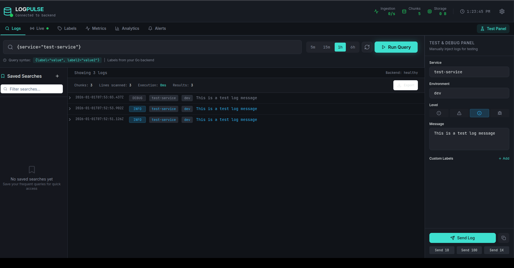
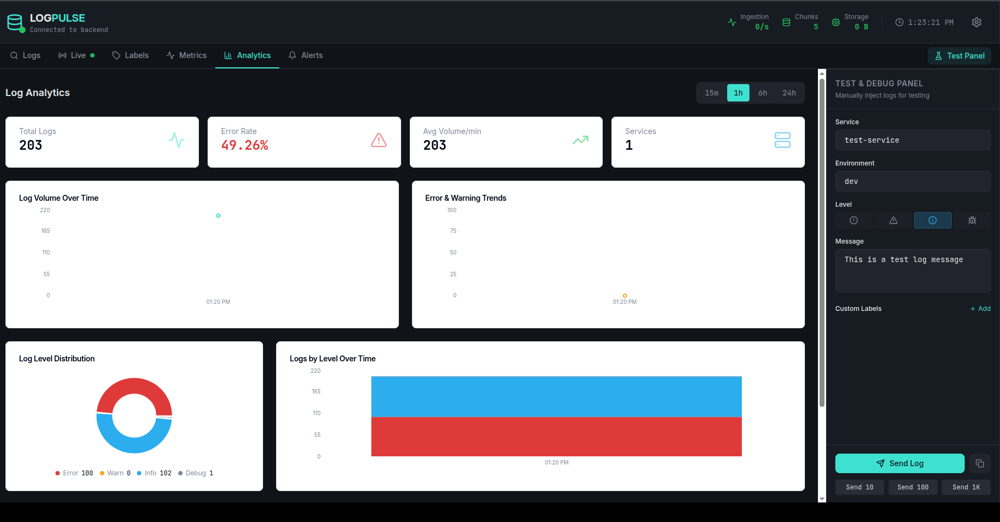

# LogPulse - Lightweight Log Aggregation System

LogPulse is a modern, real-time log ingestion and streaming platform designed for high-performance observability. Inspired by Loki, it combines a robust Go backend with a sleek React-based frontend to provide live insights into your system's logs and metrics without the overhead of full-text search indexing.

## 🚀 Features

- **Label-based Indexing**: Only indexes metadata (like Loki), not the full log content, making it extremely storage-efficient.
- **Real-Time Streaming**: WebSocket-based live log tailing via the `/stream` endpoint and UI.
- **High-Performance Ingestion**: Built with Go for handling high throughput with minimal resource usage.
- **LogQL-style Queries**: Supports a familiar syntax for querying, e.g., `{service="api", env="prod"}`.
- **Modern UI**: A premium React + TailwindCSS dashboard for visualization and querying.
- **Log Agent**: Includes a Promtail-like agent for tailing files from distributed systems.
- **OpenTelemetry Tracing**: Built-in tracing for deep system observability.
- **Zero Dependencies**: Core system runs with just the Go standard library + Gorilla packages.

## 🏗️ Architecture

```
┌─────────────────┐     ┌─────────────────┐
│   Log Agent     │────▶│   LogPulse      │
│  (tail files)   │     │    Server       │
└─────────────────┘     └────────┬────────┘
                                 │
                        ┌────────┴────────┐
                        │                 │
                   ┌────▼────┐     ┌──────▼──────┐
                   │  REST   │     │  WebSocket  │
                   │  /query │     │  /stream    │
                   └─────────┘     └─────────────┘
                                          │
                                   ┌──────▼──────┐
                                   │  Frontend   │
                                   │  Dashboard  │
                                   └─────────────┘
```

## 🛠️ Technology Stack

- **Backend**: Go (Golang), Gorilla Mux, OpenTelemetry
- **Frontend**: React, TypeScript, Vite, TailwindCSS, Radix UI
- **Storage**: Custom chunk-based time-series storage
- **Observation**: Prometheus Metrics, OTel Tracing

## 📦 Quick Start

### 1. Run Server Locally

```bash
cd backend
go mod download
go build -o logpulse ./cmd/server
./logpulse
```
Server starts at `http://localhost:8082`.

### 2. Run Frontend Locally

```bash
# In the project root (or source directory)
npm install
npm run dev
```
Frontend dashboard available at `http://localhost:5173`.

### 3. Run Agent (Optional)
To tail local log files:

```bash
go build -o logpulse-agent ./cmd/agent
./logpulse-agent -config configs/agent-config.yaml
```

### 4. Run with Docker
The easiest way to stand up the full stack (Server + Agent + Grafana + Prometheus):

```bash
cd backend/docker
docker-compose up -d
```

## 🔌 API Endpoints

| Endpoint | Method | Description |
|----------|--------|-------------|
| `/health` | GET | Health check with stats |
| `/metrics` | GET | Prometheus metrics |
| `/ingest` | POST | Ingest log streams |
| `/query` | GET | Query logs |
| `/labels` | GET | List all label keys |
| `/stream` | WebSocket | Real-time log streaming |

### Usage Examples

**Ingest Logs:**
```bash
curl -X POST http://localhost:8082/ingest \
  -H "Content-Type: application/json" \
  -d '{
    "streams": [{
      "labels": { "service": "api", "env": "prod" },
      "entries": [{ "ts": "2024-01-15T10:30:00Z", "line": "Database connected" }]
    }]
  }'
```

**Query Logs:**
```bash
curl "http://localhost:8081/query?query={service=\"api\"}&limit=50"
```

## ⚙️ Configuration

The system is configured via YAML files in the `configs/` directory.

| Component | Config File | Key Settings |
|-----------|-------------|--------------|
| **Server** | `config.yaml` | Port, Storage Path, Retention Days, API Keys |
| **Agent** | `agent-config.yaml` | Target URL, Log File Patterns, Labels |

### Environment Variables

| Variable | Default | Description |
|----------|---------|-------------|
| `LOGPULSE_PORT` | 8080 | Server port |
| `LOGPULSE_STORAGE_PATH` | ./data/logs | Storage directory |
| `LOGPULSE_API_KEY` | (none) | Enable auth |
| `LOGPULSE_SERVER_URL` | http://localhost:8081 | Agent target URL |





## 📊 Integrations

### Grafana & Prometheus
A ready-made Grafana dashboard is located at `backend/docker/grafana-dashboard.json`.
1. Run Prometheus to scrape `http://localhost:8081/prometheus-metrics`.
2. Import the JSON dashboard into Grafana.

### Kubernetes
LogPulse automatically extracts Kubernetes metadata from log labels (`k8s_namespace`, `k8s_pod`, etc.) to generate correlated metrics, allowing detailed filtering in your dashboards.

### SDKs
Integrate directly into your apps using our SDKs:
- **Node.js**: `require('./sdk/insight-stream')`
- **Python**: `from sdk.insight_stream import InsightStream`

## 🔒 Security

- **API Keys**: Configure `auth.api_key` in `config.yaml` for production.
- **CORS**: Defaults to `*` for dev. Restrict in `backend/internal/api/routes.go` for production.
- **TLS**: Use a reverse proxy (Nginx/Traefik) for SSL/TLS termination.

## 🤝 Contribution

We welcome contributions!
1. **Fork & Clone**: `git clone https://github.com/your-username/logpulse.git`
2. **Branch**: `git checkout -b feature/cool-feature`
3. **Commit**: Use descriptive messages.
4. **PR**: Open a pull request.

## 📄 License

This project is licensed under the MIT License.
